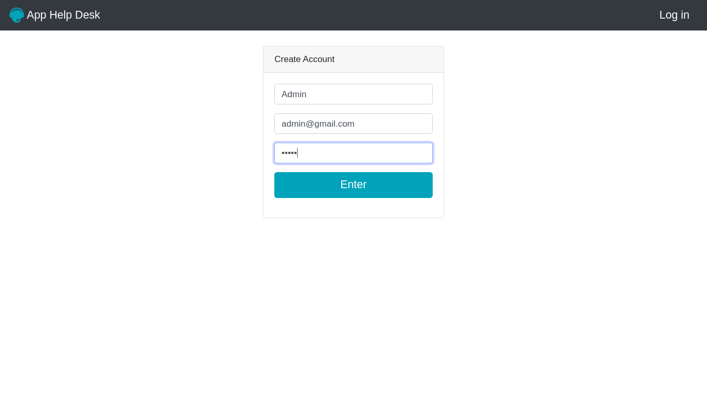
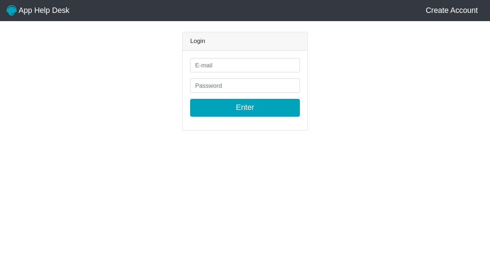
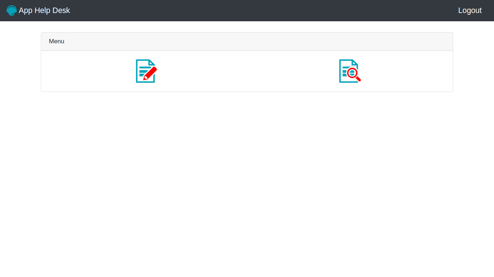
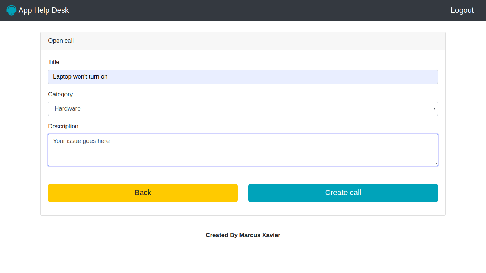
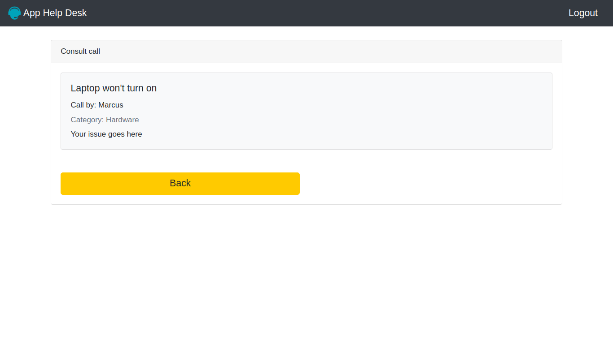

# Help Desk

Esse é um programa help desk onde é possivel fazer chamados e visualizar esses chamados. Existem dois tipos de usuários, o usuário comum que pode enviar chamados e ver apenas seus chamados e o administrador que pode ver todos os chamados.

### Para usar ele é bem simples, basta criar uma conta

### Depois fazer o login

### Você irá direto para o menu, no primeiro item você entra na página para criar chamados e no segundo você vê os seus chamados

### criar um chamado

### E esperar um administrador visualiza-la e resolver o problema
